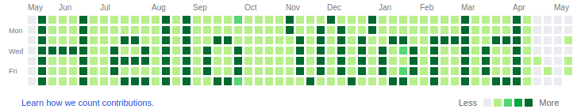

  <!-- Header Image / Greeting -->
  

    

  <!-- Animated Typing Headline -->
  

   

  <!-- Quick Highlight Pills -->
  

    
    
    
    
  

  <!-- Social Quick Connect -->
  

    
    
    
    
    
    
  

 

<!-- Radar + About Section Table -->
<table>
  <tr>
    <td width="65%" valign="top">
      <h3>🎯 Profile Overview & Scope</h3>
      

        Welcome to my digital headquarters! I am a passionate <b>Cybersecurity Engineer & Consultant</b>, <b>Full-Stack Developer</b>, and <b>Instructor</b> with over a decade of technical leadership experience.
      

      <ul>
        <li>🛡️ <b>Security First:</b> Specialized in Enterprise InfoSec, SOC Operations, SIEM/EDR architectures, and ISO 27001 compliance.</li>
        <li>🤖 <b>AI & Agentic Tech:</b> Building autonomous workflows, LLM toolings, and agentic solutions with Claude Code, Antigravity, and n8n.</li>
        <li>🚀 <b>Engineering:</b> Crafting scalable web, cloud, and mobile architectures with robust full-stack pipelines.</li>
        <li>☕ <i>"Knowledge always in my scope — lifelong learner driven by curiosity & coffee."</i></li>
      </ul>
    </td>
    <td width="35%" align="center" valign="middle">
      
    </td>
  </tr>
</table>

 

---

## 🛠️ Tech Stack & Ecosystem

### 🛡️ Cybersecurity & Defensive Operations

  
  
  
  
  
  
  

### 🤖 AI, LLMs & Agentic Systems

  
  
  
  
  
  

### 💻 Full-Stack & Systems Development

  

### ☁️ Cloud, Containers & Virtualization

  

  
  
  
  

### 🗄️ Database Management Systems

  

  
  
  

### 🧰 Dev Tools, Ops & Platforms

  

  
  
  
  
  
  

 

---

## 🎓 Verified Certifications & Credentials

| Track | Accreditations & Badges |
| :--- | :--- |
| **🛡️ Information Security & Core** |   |
| **🤖 Artificial Intelligence** |   |
| **🌐 Cisco Systems** |      |
| **🏢 IBM Security Track** |      |

 

👉 *Explore full verifiable transcripts on [Credly Profile](https://www.credly.com/users/kenan-deniz/badges)*

 

---

## 📊 GitHub Analytics & Activity

  <table border="0">
    <tr>
      <td align="center" width="50%">
        
      </td>
      <td align="center" width="50%">
        
      </td>
    </tr>
    <tr>
      <td colspan="2" align="center">
        
      </td>
    </tr>
  </table>

   

  <!-- Visitor Counter Badge -->
  

 

---

  ### 🌊 Beyond The Screen
  *Cycling 🚴 &nbsp;•&nbsp; Literature 📖 &nbsp;•&nbsp; Sailing ⛵ &nbsp;•&nbsp; Specialty Coffee ☕*

   

  Crafted with precision & passion by <b>Ken Z</b>

